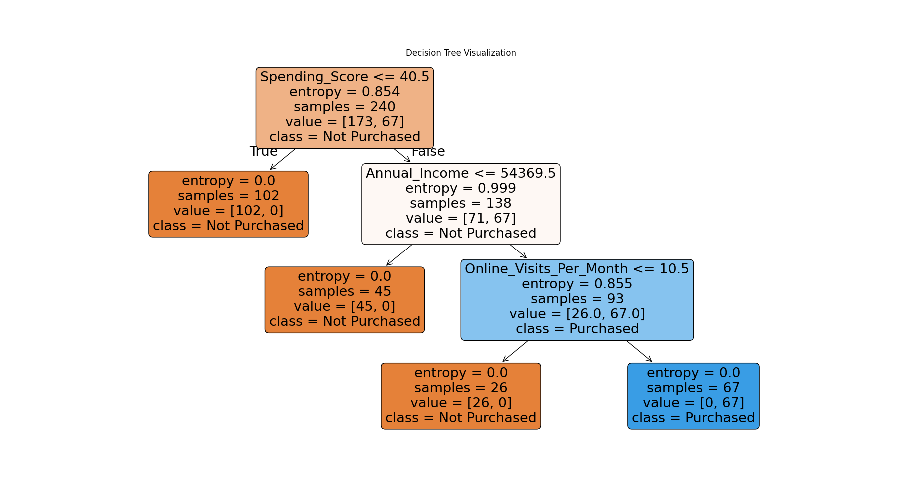

# Customer Purchase Prediction with KNN and Decision Tree

This project compares K-Nearest Neighbors (KNN) and Decision Tree classifiers to predict customer purchases.
Created by: **Yasin Dehghani**

## Dataset
The dataset contains several features about customers and a binary target variable indicating whether the customer made a purchase.

## Models
- Decision Tree Classifier  
- K-Nearest Neighbors (K=5)

## Evaluation

### Accuracy
- Decision Tree Accuracy: 0.93  
- KNN Accuracy: 0.85

### Confusion Matrix & Classification Report
The confusion matrix and classification report for both models are included in the notebook, providing insights into precision, recall, and F1-score.

## Visualization
- Decision Tree Plot: Shows the splitting criteria and how the model makes decisions.  

## Conclusion
Decision Tree outperforms KNN in terms of accuracy (0.93 vs 0.85) and offers better interpretability for understanding customer purchase behavior.  

KNN is simpler and can generalize well with properly scaled features, but its accuracy is lower on this dataset.  
For practical deployment where model interpretability is important, Decision Tree is recommended.
